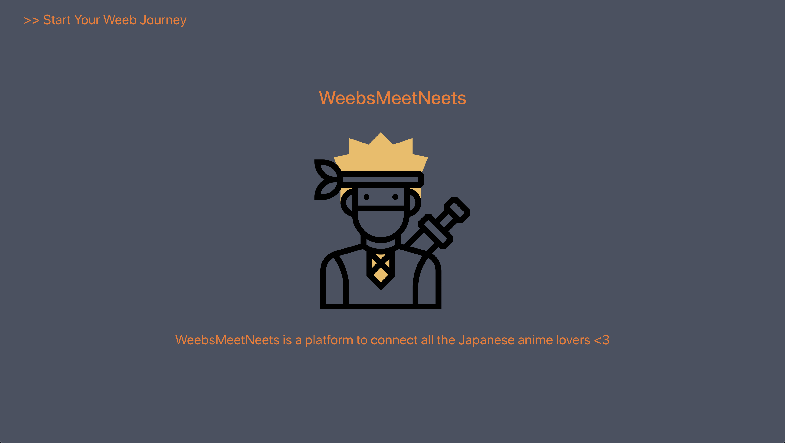
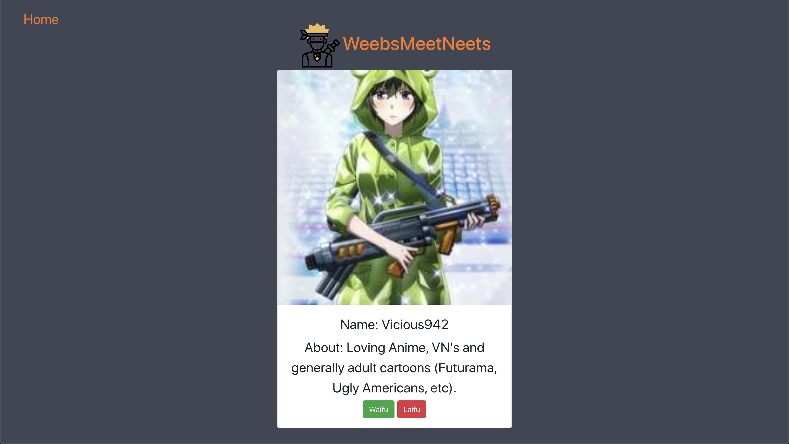
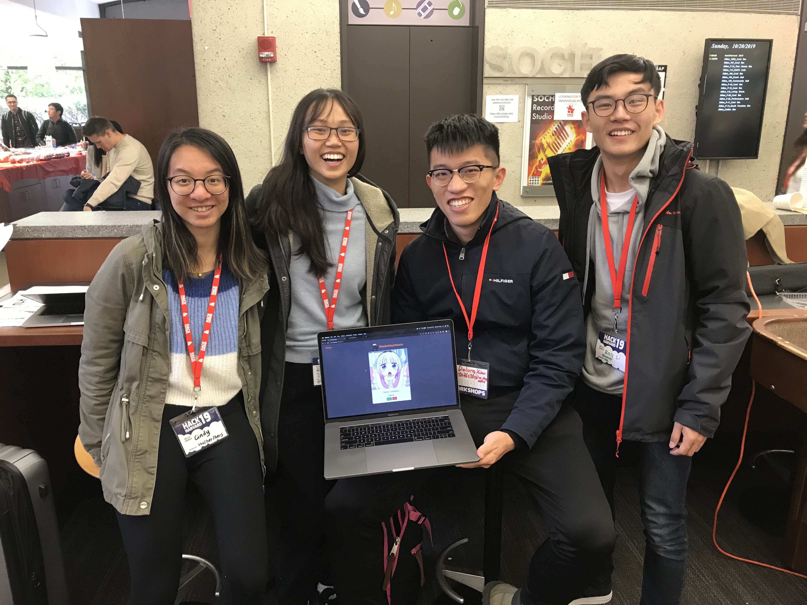

### WeebsMeetNeets
At Hackharvard 2019, in order to bring all the anime fans together and encourage people to pay more attention to the people who are so passionate about Japanese culture but are afraid to share with others, our team built an application for people to communicate online.

**Note: 
According Urban dictionary:

"Weeb is the lesser version of a weeaboo. Watches CGDCT anime, may or may not have a body pillow/waifu, usually browses r/animemes. Whatever you do, don't call them a weeb; it only makes them more powerful."

"NEET stands for 'Not in Education, Employment or Training', a term used in Japan for shut-ins who watch anime." They are a group of people that needs love and attention. 
_________________________________

## Inspiration
We want to help Naruto to find his Sasuke, Goku to find his Dragon Balls, and Luffy to find his pirate ship. Anime fans deserve love, anime fans deserve friendship! The goal of our app is to help build a world where no anime fan will be lonely ever again. 

## What it does
The app connects anime fans with anime fans. Users select people that they want to talk to based on their anime choice and waifu (favourite female anime character) or husbando (favourite male anime character). 

The user can choose between the choice of waifu or laifu. If the user picks waifu, then the user approve the other anime fan base on their anime taste. If the user picks laifu, then user disproves of their anime taste. 

WARNING: at WeebsMeetNeets, we prohibit users from trash talking other people's waifus and husbandos! This is a serious matter, all users who violates this rule will be removed by the admin. Unless your husbando is Kirito from Sword Art Online, then you just suck. 

## How we built it
We built it with our passion for anime.

# Front end:
We utitlized React to build the user interface of the application, using Kitsu API to access anime-related data.

# Back End:
Using Django Web framwork in Python and SQLite for database, we created a local host that directly provides data to front end.

## Challenges we ran into/What we learned
As we created the application, we learned React at the spot. Not only did we learn how to intergrate front end and back end with the API data but also did we learn how to design a website using UI packages.

## What's next for WeebsMeetNeets
Create a map of all weebs and NEETs around the world; App that allows people to watch anime together; Helping weebs find Facebook, Discord groups about anime so they can find a sense of belonging. 

## Contributors
[Amy Ying](https://github.com/amywhying), [Cindy Luo](https://github.com/cindy1u0), [Delong Xiao](https://github.com/dlworldpeace), and [Ray Li](https://github.com/RayRuizheLi)

